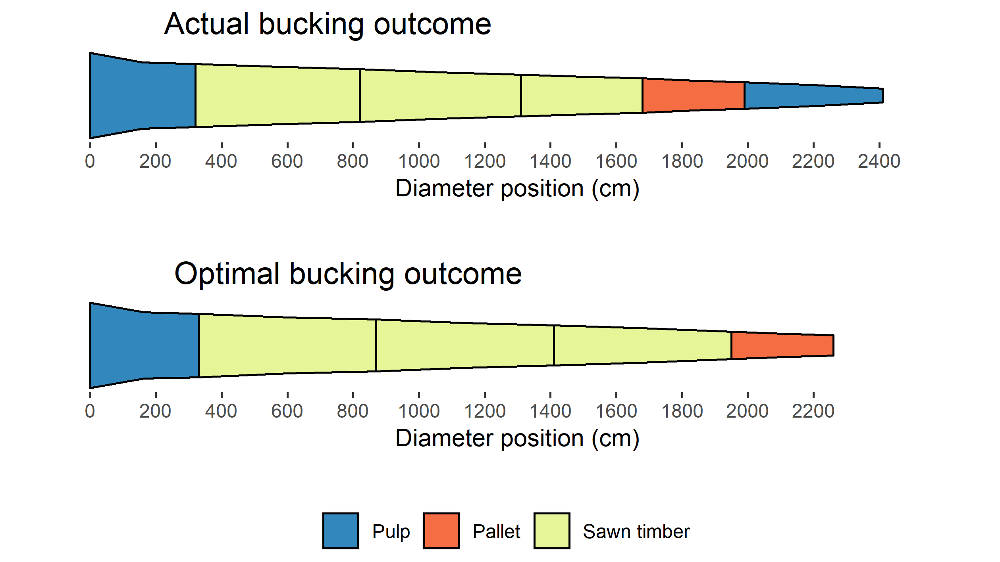

# Summary

The R package optBuck provides a set of functions for reading and handling production files from forest harvesters and computing the optimum bucking outcome for harvested trees. The package is based on harvested production report (hpr) files in the StanFord 2010 data format [@arlinger2012stanford], retrieved from single-grip harvesters. Functionality includes the extraction of production data on harvested stems, produced logs, and the bucking outcome for each harvested stem. Additionally, information on assortments, such as the species, dimension and quality requirements, and price matrices can be extracted from the hpr files. These data can then be used as input parameters in a bucking algorithm, which maximizes the total stem value using dynamic programming [@bellman1954theory; @faaland1984log]. Thus, apart from providing tools to extract and process data from single-grip harvesters, optBuck provides a means to evaluate bucking outcomes and perform sensitivity analyses and economic simulations based on harvester data.

# Statement of need

Single-grip harvesters record large amounts of standardized production data during operation. Sensors mounted on the harvester head record log dimensions and volumes, and each cut is allocated a time stamp and stored on an on-board computer. The operator selects and records tree species and timber grades, providing information on the characteristics and quality of the harvested logs. Additionally, most operating systems can be coupled with Global Navigation Satellite Systems [@olivera2016exploring], providing spatial data on the machine’s operation path and harvested trees. Harvester data are a key source of information in the fields of harvester productivity assessment, forest inventory, operation management and bucking optimization [@kemmerer2021using].   

Bucking, i.e., cutting felled trees into logs, is a primary task in timber harvesting and has great impact on the value of the produced timber (e.g. Bowers, 1998, Olsen et al., 1991). A given stem can be bucked into different numbers of logs with different dimensions, assortments, and values. Many such potential outcomes typically exist, whereby suboptimal bucking typically results in reduced timber quality and volume utilization and can reduce the economic value of the stem substantially. Besides being used in on-board computers in harvesters to aid machine operators in bucking harvested stems, bucking algorithms have found widespread application in research. For example, studies have used bucking algorithms for timber market assessments [@nybakk2007bucking; @puumalainen1998optimal] and economic simulations [@gobakken2000effect; @malinen2007comparing].   

Although machine manufacturers provide software solutions for handling production data obtained from harvesters, few other software tools, and no R packages, currently provide the functionality to read and process hpr files. In addition, no R package currently provides a bucking algorithm which can be used for bucking optimization. Apart from reading and managing information obtained from hpr files, optBuck can thus be used to evaluate the bucking efficiency (Figure 1) as well as for research purposes.

{ width=75% }

# Funding details

The optBuck package was developed as part of the project SmartForest, funded by Research council of Norway (project no. 309671). 

# References
